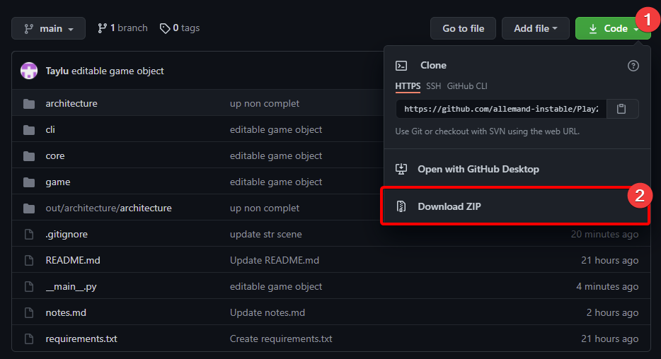

# Play2LearnPython

## What is Play2LearnPython ?

Play2LearnPython is a platform to create engaging games to learn how to code, inside the command prompt !

## Installation

### Dependencies

You can install all dependencies by installing the requirements :
`pip install -r [path-to-requirements]/requirements.txt`

- prompt_toolkit
  - `pip install prompt_toolkit==3.0.19`

- pygments
  - `pip install pygments==2.9.0`

- pyyaml
  - `pip install PyYAML==5.4.1`

### Download the game

- click on `code`
- click on `download ZIP`
- extract the ZIP file where you want the game to be installed

### launch the game

- start `__main__.py` located in root directory

## Creating Levels

[Read the Tutorial](documentation/index.md)

## TODO

- GameObject import
  - being able to have Tree Structure within gameobjects ( for instance a game object containing a list of other game objects )
  - different languages
- Interface
  - Render in HTML (prompt_toolkit) instead of standard str
  - new custom_lexer working at the time as the python lexer ( in order to recognize game objects )
  - generalize / rework the interface system to have play/game level interface and others reading interface (course ...)
  - swap language / level order
    - needs a metadata file ( and then parser )
  - language file for interface display text ( everything written in the interface is hard coded for now )
  - lexer for prompt levels / html highlights
- Loading
  -   loading screen
  -   loading times
