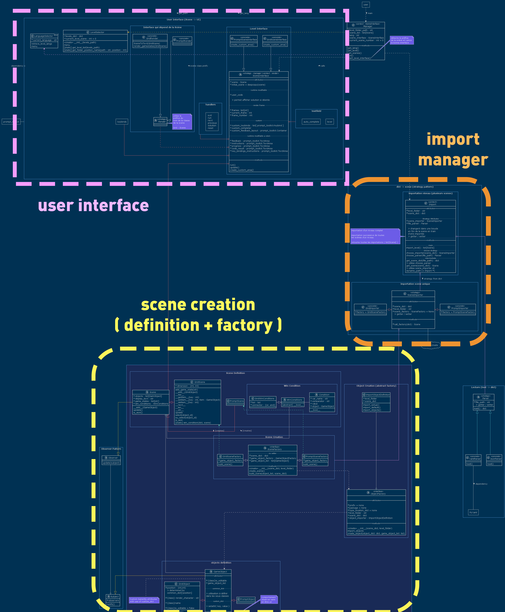
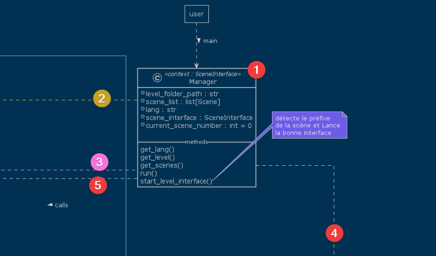
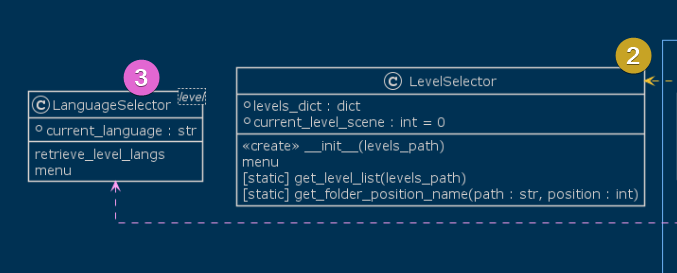
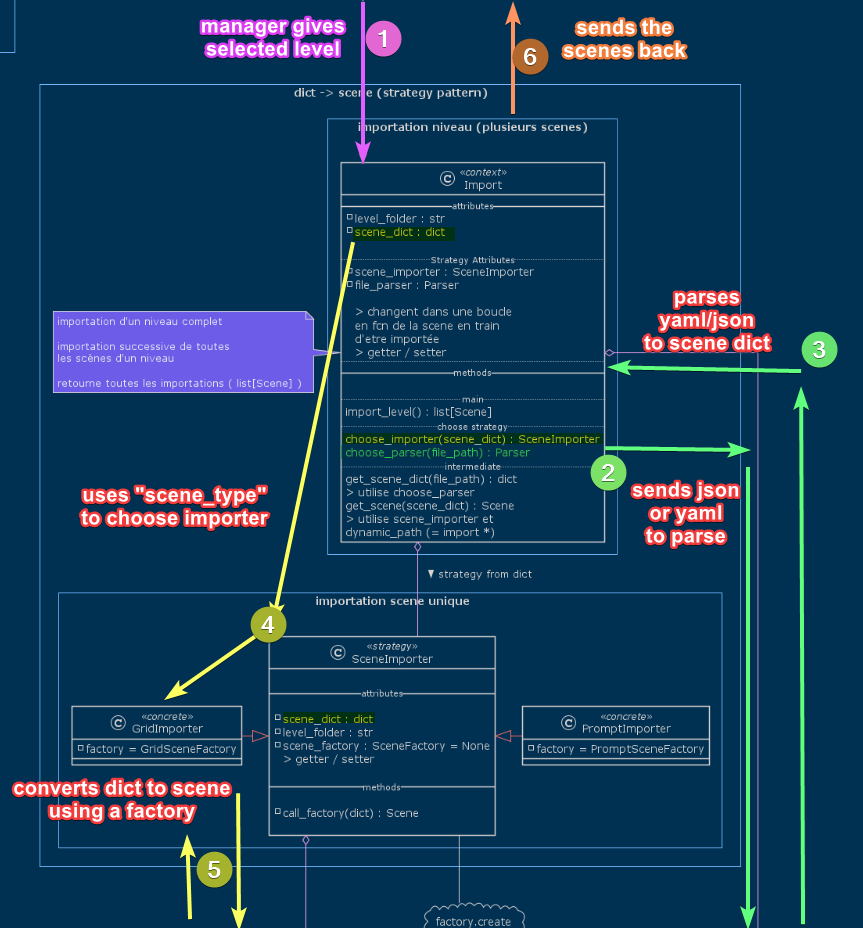
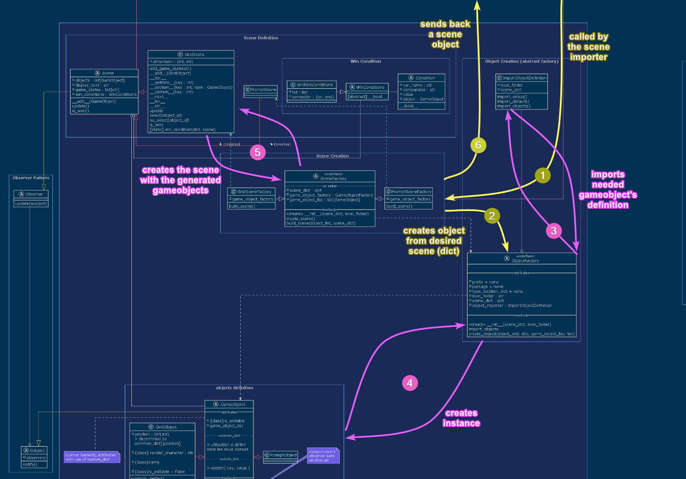

# Table Of Content

- [Table Of Content](#table-of-content)
- [overall structure](#overall-structure)
- [Program chronology](#program-chronology)
  - [step 1 : the manager](#step-1--the-manager)
  - [step 2 and 3 : the selection](#step-2-and-3--the-selection)
  - [step 4 : the import](#step-4--the-import)
  - [step 4.5 : the creation of objects instances](#step-45--the-creation-of-objects-instances)
  - [step 5 : the interface](#step-5--the-interface)

# overall structure

# Program chronology

## step 1 : the manager

## step 2 and 3 : the selection

## step 4 : the import

## step 4.5 : the creation of objects instances

## step 5 : the interface