- [A - Creating a Level Type](#a---creating-a-level-type)
  - [A.1 - Level Type Architecture](#a1---level-type-architecture)
    - [A.1.1 the definition folder](#a11-the-definition-folder)
    - [A.1.2 the factory folder](#a12-the-factory-folder)
    - [A.1.3 the importer folder](#a13-the-importer-folder)
    - [A.1.4 the user interface folder](#a14-the-user-interface-folder)
      - [`┣ 📂level_interface`](#-level_interface)
      - [`┣ 📂render`](#-render)
      - [`┗ 📂scene_interface`](#-scene_interface)
  - [A.2 - Implementing your own level type](#a2---implementing-your-own-level-type)
    - [Follow the Prefix Principle](#follow-the-prefix-principle)
    - [Create Scene's definition](#create-scenes-definition)
      - [the update method](#the-update-method)
      - [the is_won method](#the-is_won-method)
    - [Create the SceneFactory](#create-the-scenefactory)
      - [build_scene method (abstract)](#build_scene-method-abstract)
      - [create_scene method [abstract class only]](#create_scene-method-abstract-class-only)
    - [Create GameObjects' definition](#create-gameobjects-definition)
      - [is_editable attribute](#is_editable-attribute)
      - [notify method (observer pattern)](#notify-method-observer-pattern)
      - [both subject and observer](#both-subject-and-observer)
    - [Create the Renderer](#create-the-renderer)
    - [Create the user interface](#create-the-user-interface)
      - [basic window creation with prompt_toolkit](#basic-window-creation-with-prompt_toolkit)
      - [example](#example)
    - [Create WinConditions](#create-winconditions)
      - [definition](#definition)
      - [Importer](#importer)
        - [example](#example-1)
      - [Win Condition Verifier](#win-condition-verifier)

# A - Creating a Level Type

To create a custom level type, you need to implement the concrete classes that inherit from the abstract classes which are inside abstract_level_type.

A level type must have a Prefix that will be used to recognize and create instances of the level type game objects.

Thus, naming classes, modules (python files), and folders for a level type is pretty rigid, but allows a greater variety of possibilities.

To understand how to implement your own level type, let's have a look on how the engine uses the abstract classes first

## A.1 - Level Type Architecture

Each class **must** be implemented with a rigorous name :
as it can be seen on the UML class Diagram, the name of each class must begin with the level type `Prefix`.

the file structure **MUST** follow the general abstract architecture for a level type :

```
📦Play2LearnPython
 ┣ 📂abstract_level_type
 ┃ ┣ 📂definition
 ┃ ┣ 📂factory
 ┃ ┣ 📂importer
 ┃ ┗ 📂user_interface
 ```


### A.1.1 the definition folder
```
📦Play2LearnPython
 ┣ 📂abstract_level_type
 ┃ ┣ 📂definition
 ┃ ┃ ┣ 📜game_object.py
 ┃ ┃ ┣ 📜scene.py
 ┃ ┃ ┗ 📜win_conditions.py
```


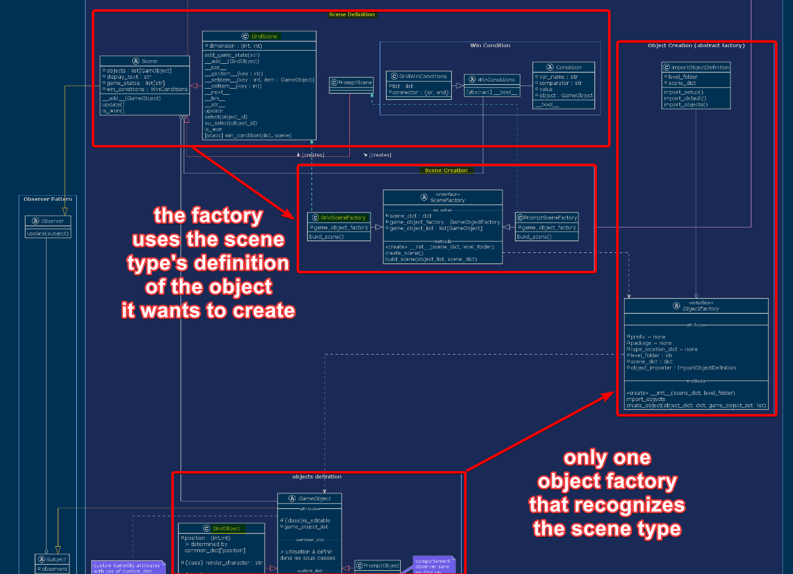


the definition folder (/package) is about defining the core objects of a scene, which include :

- The Scene itself
  - how it behaves with the objects
    - how does the scene react to an object attribute update ?
    - which attributes does the scene **observe** ( observer pattern )
- The objects
  - what do they do
  - what are their attributes
  - which attributes can be directly modified by the user
  - defining the methods which can be used by the end user

We will see in the next section how to create fully custom objects to implement them in your scene


### A.1.2 the factory folder
```
📦Play2LearnPython
 ┣ 📂abstract_level_type
 ┃ ┣ ...
 ┃ ┣ 📂factory
 ┃ ┃ ┣ 📜object_factory.py
 ┃ ┃ ┗ 📜scene_factory.py
```

Factories create the objects that need to be imported in the environment.

In the current version of Play2LearnPython, only the SceneFactory has to be implemented for a custom level type.

The Object Factory is independent from any type of level
([click here if you want to know why | Object Factory implementation](./about_the_program.md))


### A.1.3 the importer folder
```
📦Play2LearnPython
 ┣ 📂abstract_level_type
 ┃ ┣ ...
 ┃ ┣ 📂importer
 ┃ ┃ ┗ 📜scene_importer.py
```

The scene importer chooses the right factory ti create a scene as it is dependant on the level type

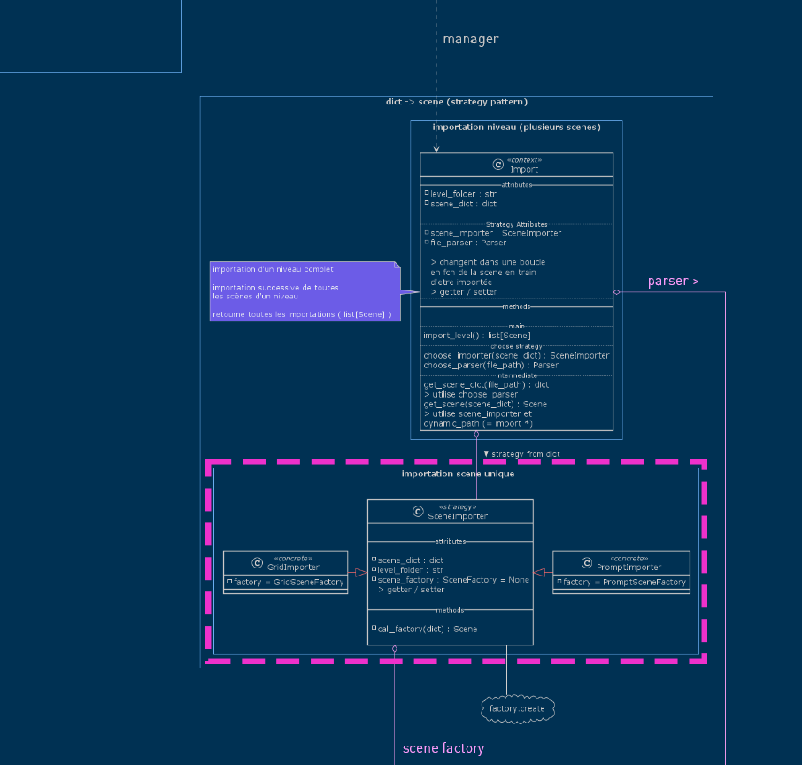


Its only role is to tell which factory will be used to import scenes :
you can see here a full implementation of such a class

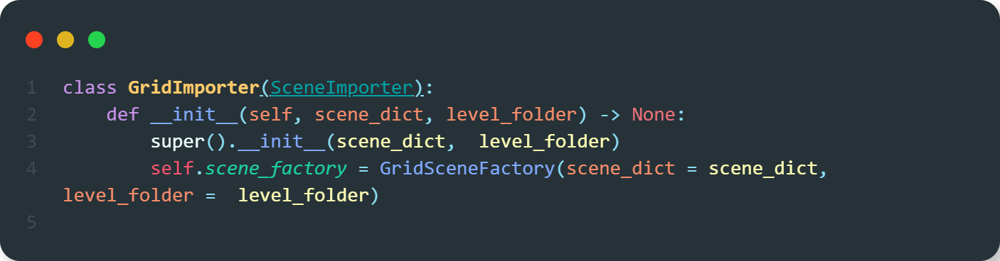

> scene_factory is the only attribute that changed

### A.1.4 the user interface folder

```
📦Play2LearnPython
 ┣ 📂abstract_level_type
 ┃ ┣ ...
 ┃ ┗ 📂user_interface
 ┃ ┃ ┃ 
 ┃ ┃ ┣ 📂level_interface
 ┃ ┃ ┃ ┗ 📂handlers
 ┃ ┃ ┃ 
 ┃ ┃ ┣ 📂render
 ┃ ┃ ┃ 
 ┃ ┃ ┗ 📂scene_interface
 ┃ ┃ ┃ ┣ 📂button_handler
 ┃ ┃ ┃ ┣ 📂keybindings
 ┃ ┃ ┃ ┣ 📂layout
 ┃ ┃ ┃ ┣ 📂textfield_engine
 ┃ ┃ ┃ ┗ 📂ui
 ```


The interface is using the `prompt_toolkit` ( [documentation](https://python-prompt-toolkit.readthedocs.io/en/stable/) ) to create an interactive CLI interface with syntax highlight for python.


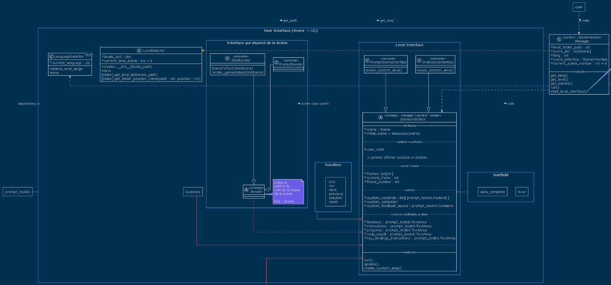


The SceneInterface (what displays the scene) is composed of a layout

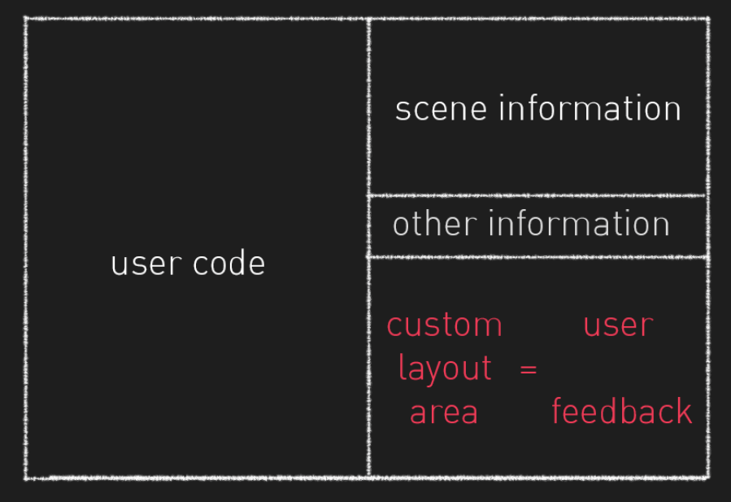

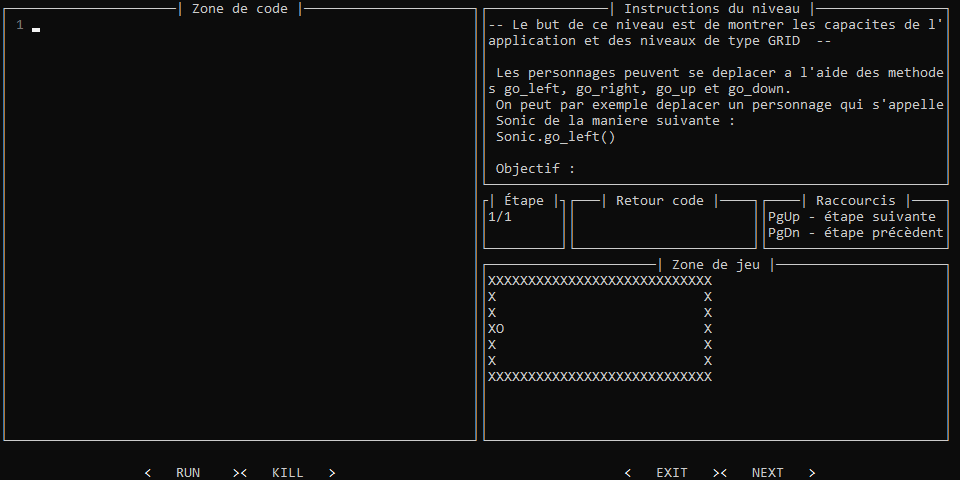


#### `┣ 📂level_interface`


#### `┣ 📂render`


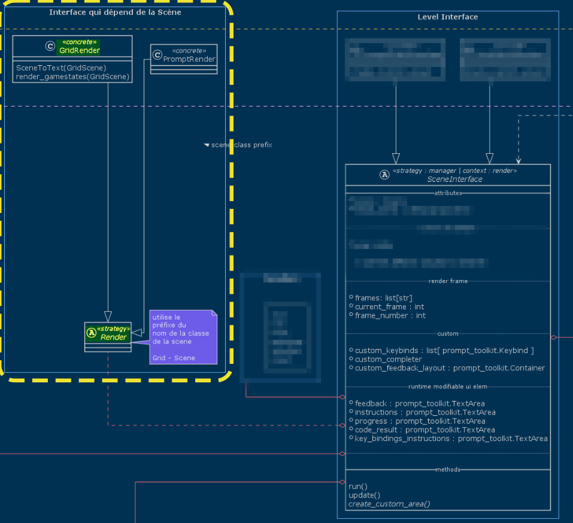

It defines how the information feedback loop to the end user has to look like.

It depends on the scene type : for instance a grid level will display a map whereas a prompt level will display text information on "opening books" (stdout redirection)

This is the feedback that reacts to GameObject changes (observer pattern)


####  `┗ 📂scene_interface`


```
 ┃ ┃ ┃ ┣ 📂keybindings
```

where keybinds are stored, they are used to do certain actions on a key press (for instance <kbd>TAB</kbd> is used to add an indentation and <kbd>PageUp</kbd> used to see the next rendered frame)

Keybinds can be customized.


For instance for a `Grid` level the class names must be as follow :


```
 ┣ 📦custom_level_types
 ┃ ┣ 📂grid
 ┃ ┃ ┣ 📂default_game_object
 ┃ ┃ ┃ ┣ 📜grid_character.py
 ┃ ┃ ┃ ┣ 📜grid_obstacle.py
 ┃ ┃ ┃ ┣ 📜grid_pnj.py
 ┃ ┃ ┃ ┗ 📜grid_teleporter.py
 ┃ ┃ ┃
 ┃ ┃ ┣ 📂definition
 ┃ ┃ ┃ ┣ 📜grid_object.py
 ┃ ┃ ┃ ┣ 📜grid_scene.py
 ┃ ┃ ┃ ┗ 📜grid_win_conditions.py
 ┃ ┃ ┃
 ┃ ┃ ┣ 📂factory
 ┃ ┃ ┃ ┣ 📜grid_object_factory.py
 ┃ ┃ ┃ ┗ 📜grid_scene_factory.py
 ┃ ┃ ┃
 ┃ ┃ ┣ 📂importer
 ┃ ┃ ┃ ┣ 📜grid_importer.py
 ┃ ┃ ┃ ┗ 📜grid_win_conditions_importer.py
 ┃ ┃ ┃
 ┃ ┃ ┗ 📂user_interface
 ===================================================
 ┃ ┃ ┃ ┣ 📂render                                   ┃
 ┃ ┃ ┃ ┃ ┗ 📜grid_render.py                         ┃
 ┃ ┃ ┃ ┃                                            ┃
 ┃ ┃ ┃ ┗ 📂scene_interface                          ┃
 ┃ ┃ ┃ ┃ ┣ 📂button_handler                         ┃
 ┃ ┃ ┃ ┃ ┃ ┣ 📜exit_handler.py                      ┃
 ┃ ┃ ┃ ┃ ┃ ┣ 📜kill_handler.py                      ┃
 ┃ ┃ ┃ ┃ ┃ ┣ 📜next_handler.py                      ┃
 ┃ ┃ ┃ ┃ ┃ ┣ 📜run_handler.py                       ┃
 ┃ ┃ ┃ ┃ ┃ ┗ 📜__init__.py                          ┃
 ┃ ┃ ┃ ┃ ┃                                          ┃    user_interface
 ┃ ┃ ┃ ┃ ┣ 📂keybindings                            ┃       folder
 ┃ ┃ ┃ ┃ ┃ ┗ 📜KeyBindings_generator.py             ┃
 ┃ ┃ ┃ ┃ ┣ 📂layout                                 ┃
 ┃ ┃ ┃ ┃ ┃ ┗ 📜layout_generator.py                  ┃
 ┃ ┃ ┃ ┃ ┣ 📂textfield_engine                       ┃
 ┃ ┃ ┃ ┃ ┃ ┣ 📜auto_complete_constructor.py         ┃
 ┃ ┃ ┃ ┃ ┃ ┗ 📜lexer_update.py                      ┃
 ┃ ┃ ┃ ┃ ┗ 📂ui                                     ┃
 ┃ ┃ ┃ ┃ ┃ ┗ 📜grid_scene_interface.py              ┃
======================================================
```


## A.2 - Implementing your own level type

### Follow the Prefix Principle


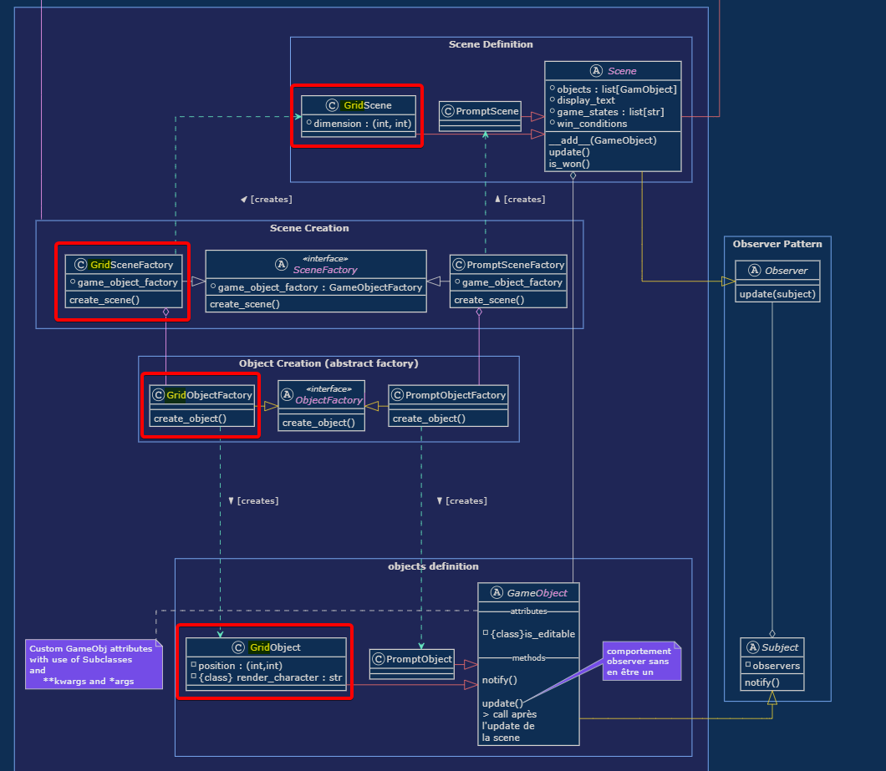


Play2LearnPython uses class names in order to create the right objects

That's why all level/scene types must have A Prefix and use it in every class

All classes must follow this rule :

`<Prefix>ClassName` 

example : implementing a SceneFactory for Prompt level type :

- `PromptSceneFactory` 

The prefix must have **1 and only 1** Uppercase :

I the level Type is `AVeryLongTitleForALevelType`

implementing a `SceneFactory` would imply that name :

`AverylongtitleforaleveltypeSceneFactory`


also the entire folder structure will have to have the prefix embedded


```
 ┣ 📦custom_level_types
 ┃ ┣ 📂prefix
 ┃ ┃ ┣ 📂default_game_object
 ┃ ┃ ┃ ┣ 📜prefix_character.py
 ┃ ┃ ┃ ┣ 📜prefix_another_object.py
 ┃ ┃ ┃ ┣ 📜prefix_this_one_is_custom_too.py
 ┃ ┃ ┃ ┗ 📜prefix_so_much_fun.py
 ┃ ┃ ┃
 ┃ ┃ ┣ 📂definition
 ┃ ┃ ┃ ┣ 📜prefix_object.py
 ┃ ┃ ┃ ┣ 📜prefix_scene.py
 ┃ ┃ ┃ ┗ 📜prefix_win_conditions.py
 ┃ ┃ ┃
 ┃ ┃ ┣ 📂factory
 ┃ ┃ ┃ ┣ 📜prefix_object_factory.py
 ┃ ┃ ┃ ┗ 📜prefix_scene_factory.py

```


example : a Grid scene type

```
 ┣ 📦custom_level_types
 ┃ ┣ 📂grid
 ┃ ┃ ┣ 📂default_game_object
 ┃ ┃ ┃ ┣ 📜grid_character.py
 ┃ ┃ ┃ ┣ 📜grid_obstacle.py
 ┃ ┃ ┃ ┣ 📜grid_pnj.py
 ┃ ┃ ┃ ┗ 📜grid_teleporter.py
```

so choose your prefix wisely !


### Create Scene's definition

```
Play2LearnPython
 ┣ 📂abstract_level_type
 ┃ ┣ 📂definition
 ┃ ┃ ┣ 📜scene.py
 ┃ ┃ ┗ ...
```

> these are the mandatory fields for a Scene


> mermaid :

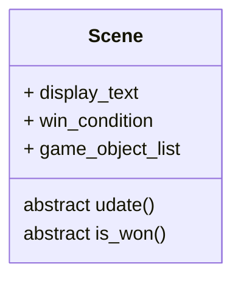


```
 ┣ 📦custom_level_types
 ┃ ┣ 📂prefix
 ┃ ┃ ┣ ...
 ┃ ┃ ┣ 📂definition
 ┃ ┃ ┃ ┣ 📜prefix_scene.py
 ┃ ┃ ┃ ┗ ...
```

example of implementation of a scene


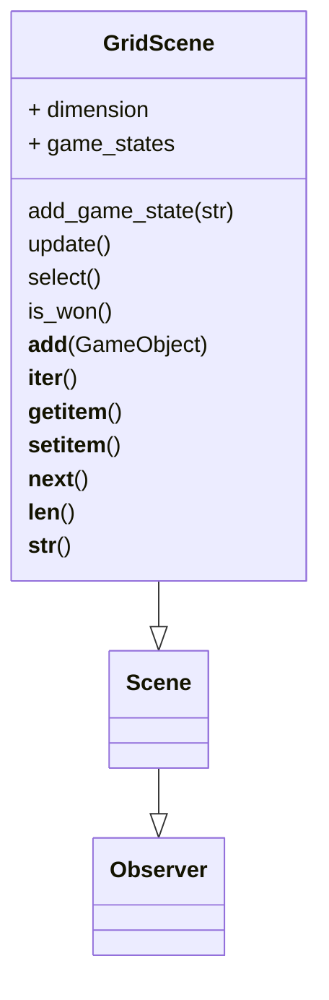


#### the update method

the `update` method is the action performed on a subject value change as it is called by the `notify` method from subject objects.
This is an observer pattern, to learn more about it, you can read the [Refactoring Guru's article on the Observer Pattern](https://refactoring.guru/design-patterns/observer)
This allows the scene to react to objects whenever they change.
It can be used for render, but also for anything else that would be useful to your level type !

here's an example of the use of update, with observer pattern to store a new game_state in a grid level everytime a game object position value changes

```python
    def update(self):
        gamestate = {}
        for game_object in self :
            # .copy() pour copier les valeurs aulieu de référencer l'objet
            obj_dict = { game_object : game_object.__dict__.copy() }
            gamestate.update(obj_dict)
        
        self.game_states.append( gamestate )
```

#### the is_won method

whenever your win condition has to get access to the game objects in the scene, you have to implement is_won method inside the scene

here is an example of `is_won` method for a Grid level type :

```python
    def is_won(self):
        return(bool(self.win_conditions))
```

it has to return a boolean, which is true if the scene is completed and false otherwise.


### Create the SceneFactory


```
📦Play2LearnPython
 ┣ 📂abstract_level_type
 ┃ ┣ ...
 ┃ ┣ 📂factory
 ┃ ┃ ┣ ...
 ┃ ┃ ┗ 📜scene_factory.py
```


#### build_scene method (abstract)

**This is the method that has to be defined by the creator**


> defines how the scene is supposed to be built, depending on the scene type

here's an example with grid level type :


```python
# do not forget to import the right classes

# LEVEL TYPE
from custom_level_types.grid.factory.grid_object_factory import GridObjectFactory
from custom_level_types.grid.definition.grid_scene import GridScene
from custom_level_types.grid.importer.grid_win_conditions_importer import GridWinConditionsImporter


[...]

class GridSceneFactory(SceneFactory):

    [...]

    def build_scene(self, scene_dict, game_object_list):
        # creates the right wincondition object
        win_conditions = GridWinConditionsImporter.create(win_condition_dict= scene_dict["win conditions"], game_object_list= game_object_list)
        # how the scene must be built : calls the right Scene Type
        scene = GridScene(dimension=scene_dict["dimension"], 
                          game_object_list=game_object_list,
                          display_text=scene_dict["display text"], 
                          win_conditions= win_conditions)
        # must return the scene
        return scene
```


#### create_scene method [abstract class only]

this method which is common for all level types (thus not needed to be defined by the creator for a custom level type) creates each game object and gives them to the scene factory to create the scene


### Create GameObjects' definition

```
Play2LearnPython
 ┣ 📂abstract_level_type
 ┃ ┣ 📂definition
 ┃ ┃ ┣ 📜game_object.py
 ┃ ┃ ┗ ...
```
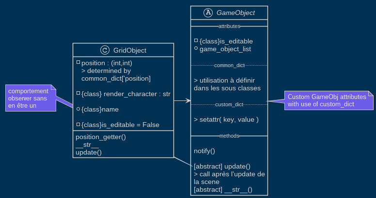

Game objects uses 2 dicts to define their attributes :

- the common dict
  - the attributes in common with all objects of the same gameobject subclass
- the custom dict
  - attributes specific to one and only one gameobject
  - implementation inside the abstract gameobject class :
    - ```python
        if custom_dict is not None :
          for key in custom_dict.keys() :
              setattr(self,key, custom_dict[key])
      ```


The attributes are implemented in dicts as follows :


```python
common_dict = {

  "common_object_attribute_name_1" : value,
  "common_object_attribute_name_2" : value,
  "common_object_attribute_name_3" : value,
  "common_object_attribute_name_4" : value

}


custom_dict = {
  "custom_object_attribute_name_1" : value,
  "custom_object_attribute_name_2" : value
}
```


creating a new game object would be like this

```python
class TypeGameObject(GameObject):
    class_attribute = value
    _private_class_attribute = value

    def __init__(self, common_dict : dict, custom_dict : dict, game_object_list : list) -> None:
        super().__init__(common_dict, custom_dict, game_object_list)
        self._common_object_attribute_name_1 = common_dict['common_object_attribute_name_1']
        self._another_name = common_dict['common_object_attribute_name_2']
        self.this_one_is_public_though = common_dict['common_object_attribute_name_3']
        self._last_one = common_dict["common_object_attribute_name_4"]
    
    # we will talk about this later
    def update(self):
      pass
```


will result in this :


#### is_editable attribute

is_editable is a boolean common for all game objects which allows ( or forbids ) the modification of a game object by the player with code

#### notify method (observer pattern)

GameObjects are Subjects by default, they notify their observers whenever needed
it can be when a value changes (for instance to save a new gamestate on the change of the value of a specific attribute | cf grid level type) : to implement such a thing, you can do it by calling `notify` in the setter of a `@property` like the following example :

```python
    """
    GETTER
    """
    @property
    def position(self):
        return self._position
    
    """
    SETTER
    """
    @position.setter
    def position(self, value):
        self._position = value
        # notifies oberservers (the scene in these case) on each position change
        self.notify()
```

if you don't want the propert to be modified directly via the code by the user, but still notfy changes you can notify from custom methods :
for instance in grid levels we don't players to be able to teleport to the desired area :

therefore, we restrict the character's movements with `go_right`, `go_down` methods

we modify of the position change inside these methods :

```python
class GridCharacter(GridObject):
    is_editable= True

    [...]

    def modify_pos_if_legal(self, new_pos):
        """modifies character position to new_pos if the position is legal
        """
        if self.is_pos_legal(new_pos) :
            self._position = tuple(new_pos)
            self.notify()

    def go_right(self):
        """moves the character to the right (+1 on x axis)
        """
        new_pos = [self.position[0] + 1, self.position[1]]
        self.modify_pos_if_legal(new_pos)
```


#### both subject and observer


if you don't want your object to act like a subject AND an observer at the same time, just create the `update()` method with a `pass`

```python
    def update(self, game_objects_list):
        pass
```

even though GameObject does **not** inherit from Observer class, this method allows it to have observer like behavior on demand.

### Create the Renderer

The renderer is in charge of the output string showed in the suer interface as a feedback of the end user/player code.


the renderer has to output a `list of strings`
with each string being `a frame`
the end user will be able to navigate between these frames

you can choose with this system

- to output a single frame : all the information on the same page
- to output several frames
  - to show time evolution
  - to have different type of information on different pages
  - or more.


It can be based on the objects of the scene, or simply a redirection of the standard output.

Indeed different level types can require major differences in the way the feedback has to be rendered.

For instance, in the prompt levels we only need to redirect the standard output :
```python
class PromptRender():
    
    def __init__(self) -> None:
        pass

    @staticmethod
    def render(interface : SceneInterface) -> list:
        """
        Retourne le standard output

        c'est à l'utilisateur de faire print
        """
        # TODO : calculer le nombre de lignes de la frame render pour ne pas avoir de scroll bar
        # non prioritaire
        
        stdout_list = interface.stdout_stream.data
        str = "".join(stdout_list)

        return [str]
```

Whereas a grid level has to render to a text a 2D scene, based on the position of the objects
( you don't have to read the code, just notice the major difference between these two )


```python
class GridRender():
    
    def __init__(self) -> None:
        pass

    @staticmethod
    def SceneToText( scene ) -> str:
        """Fait le rendu de l'état actuel d'une scène et le renvoie sous forme de string

        """
        # on initialise les lignes :
        # on met du vide (espace) sur toute la longueur de la grille ( dimension suivant x)
        # il y a (dimension sur y) lignes
        Lignes = [ " " * scene.dimension[0] for i in range(scene.dimension[1]) ]
        # on vient modifier le caractère de la position de l'objet
        # en remplaçant l'espace par le caractère associé à la classe
        # du GameObject
        for object in scene.game_object_list :
            x = object.position[0]
            y = object.position[1]
            Lignes[y] = replace_character(str = Lignes[y], 
                                        pos = x, 
                                        char = object.game_object_character)
        return "\n".join(Lignes)

    @staticmethod
    def render(interface):
        # on initialise les lignes :
        # on met du vide (espace) sur toute la longueur de la grille ( dimension suivant x)
        # il y a (dimension sur y) lignes
        #print(len(scene.game_states))
        render = [ [ " " * interface.scene.dimension[0] for i in range(interface.scene.dimension[1]) ] for k in range( len(interface.scene.game_states) ) ]
        #          |            axe x        |          axe y                   |               temps                |
        # on fait le rendu de chaque game state une à une
        #pprint(render)
        final_render = []
        for state in interface.scene.game_states :
            # on parcourt tous les objets d'une game state ( par leur id )
            #print("====== STATE ========")
            #pprint(state)

            for object in state :
                # on récupère leur position
                x = state[object]["_position"][0]
                y = state[object]["_position"][1]
                # on modifie la ligne où doit se situer l'objet
                # (ie on fixe y)
                #               numero de la frame             ligne
                #             = position de la state
                # et on place le caractère associé au type de game_object à la position x (de la ligne y)
                render[ interface.scene.game_states.index(state) ][ y ] = replace_character(str = render[ interface.scene.game_states.index(state) ][ y ], pos = x, char = object.game_object_character)
                #                 ligne                                                             ligne                              colonne        can select even non editable objects
                #print(render)
            final_state_render = ""
            final_state_render = "\n".join(render[ interface.scene.game_states.index(state) ])
            final_render.append(final_state_render)
            #print("======= FIN STATE ======")
        return final_render
```


### Create the user interface

  > understanding how to use prompt_toolkit might help you achieve your vision
  >
  > [check the documentation](https://python-prompt-toolkit.readthedocs.io/en/master/)

  > basics will be however covered here to create a simple user feedback area, if you want very specific and dive deeper in customization, having a look at the prompt_toolkit documentation is highly recommended

  Play2LearnPython has a standrad interface for every level type, however there's a custom feedback area that can be customized depending on the level type.

  

  The way the boxes are being organized is called **The Layout**
  it uses the `Layout` class from `prompt_toolkit` to define the place of each "box" in the user interface.


#### basic window creation with prompt_toolkit

> for more advanced window layouts, please read the prompt_toolkit documentation

You can create a custom feedback window by creating a `container`
a container is composed of several `window frames` that can be rearranged in the order you like and with the desired scale.

for instance we can create a container with 3 frames split horizontally

```
CONTAINER :
        _____________________________
        |                           |
        |                           |
        |        1ST FRAME          |   
        |___________________________|
        |         2ND FRAME         |
        |___________________________|
        |                           |   
        |         3RD FRAME         |
        _____________________________
```

> using `HSplit( [ Frame1, Frame2, ... ] )` function

or even vertically


```
CONTAINER :
        _____________________________
        |        |               |  |
        |        |               |  |
        |        |               |  |   
        |   1    |       2       |3 |
        |        |               |  |
        |        |               |  |
        |        |               |  |   
        |        |               |  |
        _____________________________
```


> using `VSplit( [ Frame1, Frame2, ... ] )` function


To define the proportion of their scale comapred to each other, you can use the `weight` parameter :
```python
self.feedback_area = TextArea(read_only=True, height=Dimension(weight=0.8))
```

then define a `window frame` :
```python
frame1 = Frame(
              body = self.feedback_area,
              title = 'Zone de print'
              ) 
```


```python
frame2 = TextArea(
                  multiline= False,             # the user won't be able to make line jumps
                  read_only=False,              # the user can write in it
                  height= 1,                    # fixed height instead of relative to other window frames
                  scrollbar=False,              # can be scrolled if the text is too long
                  validator= AnswerValidator(answer = scene.answer),    # makes sure the user input satisfies some conditions
                                                                        # not explained here, check prompt_toolkit's documentation
                  focusable= True,     # the user can switch focus to this area
                  focus_on_click= True # the user can focus on this area to write things down by clicking with the mouse on the area
                  )
```

and finally

```python
container = HSplit( [ frame1, frame2 ] )

#  or

container = VSplit( [ frame1, frame2 ] )
```


Frames can be from several types :

- TextArea
  - can be used to
    - display string
    - create an input prompt
      - with/without line count
      - with/without lexer and syntax highlight

- radial selection [checkbox with only 1 choice]

- Checkbox selection


#### example

  ```python
        #! custom layout area

        #? set as an attribute so we can modify it when the user code is run
        self.feedback_area = TextArea(read_only=True, height=Dimension(weight=0.8))

        #? user input area
        self.user_prompt = TextArea(
                                    multiline= False,
                                    read_only=False,
                                    height= 1,
                                    scrollbar=False,
                                    validator= AnswerValidator(answer = scene.answer),
                                    focusable= True,
                                    focus_on_click= True
                                    )

        # stick the two boxes together with HSPLIT (horizontal split)
        container = HSplit( [ Frame(
                                    body = self.feedback_area,
                                    title = 'Zone de print'
                                    ), 
                              Frame(
                                      body = self.user_prompt,
                                      title = 'Réponse'
                                    ) 
                            ] )


        """CONTAINER :
        _____________________________
        |                           |
        |                           |
        |            RENDER         |   <= first text area
        |                           |
        |                           |
        |___________________________|
        |                           |   <= second text area
        |         USER   INPUT      |
        _____________________________
        """

  ```

```python
  super().__init__(scene, language, render = PromptRender , play_area = container)
```


### Create WinConditions


#### definition

- You must define the concrete class `LeveltypeWinCondition`, subclass of the abstract class `WinCondition`
  - constructor :
    - whatever you need for your condition
  - `__bool__` : defines the level type condition
    - must return `True` if the level is completed
    - must return `False` if it is not

```
Play2LearnPython
 ┣ 📂abstract_level_type
 ┃ ┣ 📂definition
 ┃ ┃ ┣ ...
 ┃ ┃ ┗ 📜win_conditions.py
```


```python
class WinConditions(ABC):

    @abstractmethod
    def __bool__(self):
        pass
```


#### Importer

- The concrete class `TypeWinConditionImporter`, subclass of `WinConditionImporter`
  - returns a `TypeWinCondition` object
  - from parsed scene yaml/json/...
    - `create` method (static)
  - meant to be stored in the `TypeScene` object
  - constructor
    - scene's gameobject list (to make the win condition able to interact with them)
    - win condition parsed dict

##### example

```python
class GridWinConditionsImporter(WinConditionsImporter):

    def __init__():
        pass

    @staticmethod
    def create(win_condition_dict : dict, game_object_list : list):
        '''
        Retourne l'object win_condition lié à une scène de type Grid
        '''
        if 'comparator' not in win_condition_dict.keys():
            connector = list(win_condition_dict.keys())[0]
            condition_list = [GridWinConditionsImporter.create(dict1,game_object_list) for dict1 in win_condition_dict[connector]]
            return(GridWinConditions(list = condition_list,connector = connector))
            #       returns a win condition


        else:
            return(Condition(game_object_list = game_object_list,
                            id = win_condition_dict['id'],
                            var_name = win_condition_dict['var_name'],
                            comparator = win_condition_dict['comparator'],
                            value = win_condition_dict['value']))
            # note : don't mind the different class, it's specific to the level type, here.
            #     returns a win condition
```


#### Win Condition Verifier

- The win condition is verified inside the `TypeInterface` class
  - verfied by the method `is_won`
    - allows win condition based on interface elements (for instance user input in prompt [flag] )
    - can call `is_won` method from `TypeScene` (if needed)
      - whenever the win condition is based on attributes / state of a certain scene's game object
  - the verification is checked once the end user code was properly executed.
    - the <kbd>RUN</kbd> button is common to all interfaces
      - calls `self.interface.is_won`

```python

```


